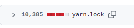

## Шаблон для проекта на React

- Настроен линтер c необходимыми правилами и prettier с сортировкой импортов
- Подготовлен к lazy routing
- Обработка ошибок с запросами и отображение уведомлений через @mantine/notifications (при ошибке)
- Преднастроен error-boundary для отлова клиентских ошибок
- Feature-first подход в построении модулей
- Пре-коммит хук на проверку измененных файлов линтером
- Простой пример модульного теста для авторизации
- Установлено и настроено:
  - Mantine (библиотека компонент и не только)
  - Axios (запросы)
  - Tabler-icons-react (иконки)
  - Zustand c devtools

Основан на Vite вместо устаревшего и громоздкого CRA, что дает:

1. Резкое уменьшение количества зависимостей (сравнение после удаления)

2. Ускорения билда (в 2-3 раза с уменьшенным потреблением оперативной памяти) и HMR для комфортной разработки.

# Структура шаблона

### base

Базовые вещи для шаблона, необходимые в работе. Например, сейчас инициализация firebase и http (axios).

### components

Переиспользуемые UI компоненты и лэйауты.

### modules

Бизнес-логика, а именно взаимодействие с данными извне и их обработка (service, если firebase - ...firebaseService), а
также хранение (store с использованием MobX).

Разделение по папкам на основе зоны ответственности.

Все используемые модели в файле ...types или даже лучше выделить их в папку models. Аналогично с DTO.

### routes

Регистрация экранов в роутинге, а также список экранов для навигации. Адреса также регистрируются в Routes для простого
импорта и переименовывания.

### screens

Экраны, нейминг папки отражает суть экрана. Внутри могут быть локально переиспользуемые компоненты (например карточки,
выделяем в components) и модули для логичного разделения внутри одной страницы

### styles

Все что связано с темой и ее настройкой, подключение шрифтов.
